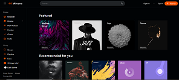

<!-- Improved compatibility of back to top link: See: https://github.com/janto-pee/Music-Streaming-Project/pull/73 -->
<a name="readme-top"></a>
<!--
*** Thanks for checking out the Best-README-Template. If you have a suggestion
*** that would make this better, please fork the repo and create a pull request
*** or simply open an issue with the tag "enhancement".
*** Don't forget to give the project a star!
*** Thanks again! Now go create something AMAZING! :D
-->


<!-- PROJECT SHIELDS -->
<!--
*** I'm using markdown "reference style" links for readability.
*** Reference links are enclosed in brackets [ ] instead of parentheses ( ).
*** See the bottom of this document for the declaration of the reference variables
*** for contributors-url, forks-url, etc. This is an optional, concise syntax you may use.
*** https://www.markdownguide.org/basic-syntax/#reference-style-links
-->
<!-- [![Contributors][contributors-shield]][contributors-url]
[![Forks][forks-shield]][forks-url]
[![Stargazers][stars-shield]][stars-url]
[![Issues][issues-shield]][issues-url]
[![MIT License][license-shield]][license-url]
[![LinkedIn][linkedin-shield]][linkedin-url] -->


<!-- PROJECT LOGO -->
<br />
<div align="center">
  <a href="https://github.com/janto-pee/Music-Streaming-Project">
    
  </a>

  <h3 align="center">Music Streaming Project</h3>

  <p align="center">
    An enterprise level vuejs project taking you from zero to hero
    <br />
    <a href="https://github.com/janto-pee/Music-Streaming-Project"><strong>Explore the docs »</strong></a>
    <br />
    <br />
    <a href="https://github.com/janto-pee/Music-Streaming-Project">View Demo</a>
    ·
    <a href="https://github.com/janto-pee/Music-Streaming-Project/issues">Report Bug</a>
    ·
    <a href="https://github.com/janto-pee/Music-Streaming-Project/issues">Request Feature</a>
  </p>
</div>


<!-- TABLE OF CONTENTS -->
<details>
  <summary>Table of Contents</summary>
  <ol>
    <li>
      <a href="#about-the-project">About The Project</a>
      <ul>
        <li><a href="#built-with">Built With</a></li>
      </ul>
    </li>
    <li>
      <a href="#getting-started">Getting Started</a>
      <ul>
        <li><a href="#prerequisites">Prerequisites</a></li>
        <li><a href="#installation">Installation</a></li>
      </ul>
    </li>
    <li><a href="#usage">Usage</a></li>
    <li><a href="#roadmap">Roadmap</a></li>
    <li><a href="#contributing">Contributing</a></li>
    <li><a href="#license">License</a></li>
    <li><a href="#contact">Contact</a></li>
    <li><a href="#acknowledgments">Acknowledgments</a></li>
  </ol>
</details>


<!-- ABOUT THE PROJECT -->
## About The Project

[![Product Name Screen Shot][screenshot]](https://github.com/janto-pee/Music-Streaming-Project)

Think of an app like Audiomack or Spotify. In this vuejs project, we'll be building a large-scale Vue applications from scratch. you'll master the basics of vuejs and proceed to more advanced concept. This is not a dummy project, this project will be shipped for usage by millions of music lovers. So its a highly scalable enterprise level application. At the end of this project, you'll have mastered all you need to be a top vuejs developer.

Here are some things you'll be learning:
* Vue Essentials: Template Syntax, Reactivity Fundamentals, Computed Properties,Class and Style Bindings, Conditional Rendering, List Rendering, Event Handling, Form Input Bindings, Lifecycle Hooks, Watchers and more..
* Modular Component structure:  Registration, Props, Events, Fallthrough Attributes, Slots, Provide / inject, Async Components
* Libraries and Plugins: Webpack, Babel, Eslint, Vee-validate, Firebase...

Build a scalable Vue application and deploy to production File Uploads, Drag and drop support Testing, PWAs, Internationalization, Form Authentication with Vue and vee-validate Firebase integration, Firestore, Auth, and Cloud Storage TailwindCSS integration State management Performance and scalablity tradeoffs Routing with Vue Router Testing

<p align="right">(<a href="#readme-top">back to top</a>)</p>


### Built With

We'll be b.uilding a fullstack project, therefore we'll be using alot of technologies on both the frontend and backend 

* [![Vue][Vue.js]][Vue-url]
* [![Docker][Docker.com]][Docker-url]
* [![Nuxt][Nuxt.com]][Nuxt-url]
* [![Firebase][Firebase.com]][Firebase-url]
* [![Tailwindcss][Tailwindcss.com]][Tailwindcss-url]
* [![Laravel][Laravel.com]][Laravel-url]
* [![Bootstrap][Bootstrap.com]][Bootstrap-url]
* [![JQuery][JQuery.com]][JQuery-url]
<!-- <div style="display:flex;flex-direction:column">
  
  
  
  
  
  
  
  
</div> -->


<p align="right">(<a href="#readme-top">back to top</a>)</p>

### Built With

* Project Day 1: FIGMA TO TEMPLATE

* Project Day 2: STATE MANAGEMENT

* Project Day 3: FORM AUTHENTICATION| SIGN-UP & SIGN IN

* Project Day 4: VUE ROUTER

* Project Day 5: MUSIC UPLOAD

* Project Day 6: PLAYING MUSIC

* Project Day 7: PERFORMANCE & OPTIMIZATION

* Project Day 8: TESTING

* Project Day 9: DEPLOYMENT


<!-- GETTING STARTED -->
## Getting Started

We'll be using Vite to scaffold our app. Vite is a build tool that aims to provide a faster and leaner development experience for modern web projects.

### Prerequisites

This is an example of how to list things you need to use the software and how to install them.
* npm
  ```sh
  npm init vue@latest
  ```

### Installation

_Below are steps on how to run your first vue development server._

1. Start with vith [vite](https://vitejs.dev/guide/#scaffolding-your-first-vite-project) or
2. Clone the repo
   ```sh
   git clone https://github.com/janto-pee/Music-Streaming-Project"
   ```
3. Install all packages
   ```sh
   npm install
   ```
4. Start `development server`
   ```sh
   npm run dev
   ```

<p align="right">(<a href="#readme-top">back to top</a>)</p>


<!-- USAGE EXAMPLES -->
## Timeline

This project will commence on the 12th of September and be completed by 21st of same month. All resources will be made accessible to everyone.

_For more details, Dont hesitate to contact me [Linkedin](https://linkedin.com/in/adejumo-ayobami-347bb9227)_

<p align="right">(<a href="#readme-top">back to top</a>)</p>


<!-- ROADMAP -->
## Roadmap

- [x] Add Changelog
- [x] Add back to top links
- [ ] Add Additional Templates w/ Examples
- [ ] Add "components" document to easily copy & paste sections of the readme
- [ ] Multi-language Support
    - [ ] Chinese
    - [ ] Spanish

See the [open issues](https://github.com/janto-pee/Music-Streaming-Project/issues) for a full list of proposed features (and known issues).

<p align="right">(<a href="#readme-top">back to top</a>)</p>


<!-- CONTRIBUTING -->
## Contributing

Contributions are what make the open source community such an amazing place to learn, inspire, and create. Any contributions you make are **greatly appreciated**.

If you have a suggestion that would make this better, please fork the repo and create a pull request. You can also simply open an issue with the tag "enhancement".
Don't forget to give the project a star! Thanks again!

1. Fork the Project
2. Create your Feature Branch (`git checkout -b feature/AmazingFeature`)
3. Commit your Changes (`git commit -m 'Add some AmazingFeature'`)
4. Push to the Branch (`git push origin feature/AmazingFeature`)
5. Open a Pull Request

<p align="right">(<a href="#readme-top">back to top</a>)</p>


<!-- LICENSE -->
## License

Distributed under the MIT License. See `LICENSE.txt` for more information.

<p align="right">(<a href="#readme-top">back to top</a>)</p>


<!-- CONTACT -->
## Contact

Adejumo Ayobami - [Linkedin](https://linkedin.com/in/adejumo-ayobami-347bb9227) - ayobami_adejumo@yahoo.com

Project Link: [https://github.com/janto-pee/Music-Streaming-Project](https://github.com/janto-pee/Music-Streaming-Project)

<p align="right">(<a href="#readme-top">back to top</a>)</p>


<!-- ACKNOWLEDGMENTS -->
## Acknowledgments

* [Choose an Open Source License](https://choosealicense.com)
* [GitHub Emoji Cheat Sheet](https://www.webpagefx.com/tools/emoji-cheat-sheet)
* [Malven's Flexbox Cheatsheet](https://flexbox.malven.co/)
* [Malven's Grid Cheatsheet](https://grid.malven.co/)
* [Img Shields](https://shields.io)
* [GitHub Pages](https://pages.github.com)
* [Font Awesome](https://fontawesome.com)

<p align="right">(<a href="#readme-top">back to top</a>)</p>


<!-- MARKDOWN LINKS & IMAGES -->
<!-- https://www.markdownguide.org/basic-syntax/#reference-style-links -->
[contributors-shield]: https://img.shields.io/github/contributors/othneildrew/Best-README-Template.svg?style=for-the-badge
[contributors-url]: https://github.com/janto-pee/Music-Streaming-Project/graphs/contributors
[forks-shield]: https://img.shields.io/github/forks/othneildrew/Best-README-Template.svg?style=for-the-badge
[forks-url]: https://github.com/janto-pee/Music-Streaming-Project/network/members
[stars-shield]: https://img.shields.io/github/stars/othneildrew/Best-README-Template.svg?style=for-the-badge
[stars-url]: https://github.com/janto-pee/Music-Streaming-Project/stargazers
[issues-shield]: https://img.shields.io/github/issues/othneildrew/Best-README-Template.svg?style=for-the-badge
[issues-url]: https://github.com/janto-pee/Music-Streaming-Project/issues
[license-shield]: https://img.shields.io/github/license/othneildrew/Best-README-Template.svg?style=for-the-badge
[license-url]: https://github.com/janto-pee/Music-Streaming-Project/blob/master/LICENSE.txt
[linkedin-shield]: https://img.shields.io/badge/-LinkedIn-black.svg?style=for-the-badge&logo=linkedin&colorB=555
[linkedin-url]: https://linkedin.com/in/othneildrew
[product-screenshot]: images/screenshot.png
[Next.js]: https://img.shields.io/badge/next.js-000000?style=for-the-badge&logo=nextdotjs&logoColor=white
[Next-url]: https://nextjs.org/
[React.js]: https://img.shields.io/badge/React-20232A?style=for-the-badge&logo=react&logoColor=61DAFB
[React-url]: https://reactjs.org/
[Vue.js]: https://img.shields.io/badge/Vue.js-35495E?style=for-the-badge&logo=vuedotjs&logoColor=4FC08D
[Vue-url]: https://vuejs.org/
[Angular.io]: https://img.shields.io/badge/Angular-DD0031?style=for-the-badge&logo=angular&logoColor=white
[Angular-url]: https://angular.io/
[Svelte.dev]: https://img.shields.io/badge/Svelte-4A4A55?style=for-the-badge&logo=svelte&logoColor=FF3E00
[Svelte-url]: https://svelte.dev/
[Laravel.com]: https://img.shields.io/badge/Laravel-FF2D20?style=for-the-badge&logo=laravel&logoColor=white
[Laravel-url]: https://laravel.com
[Bootstrap.com]: https://img.shields.io/badge/Bootstrap-563D7C?style=for-the-badge&logo=bootstrap&logoColor=white
[Bootstrap-url]: https://getbootstrap.com
[JQuery.com]: https://img.shields.io/badge/jQuery-0769AD?style=for-the-badge&logo=jquery&logoColor=white
[JQuery-url]: https://jquery.com 
